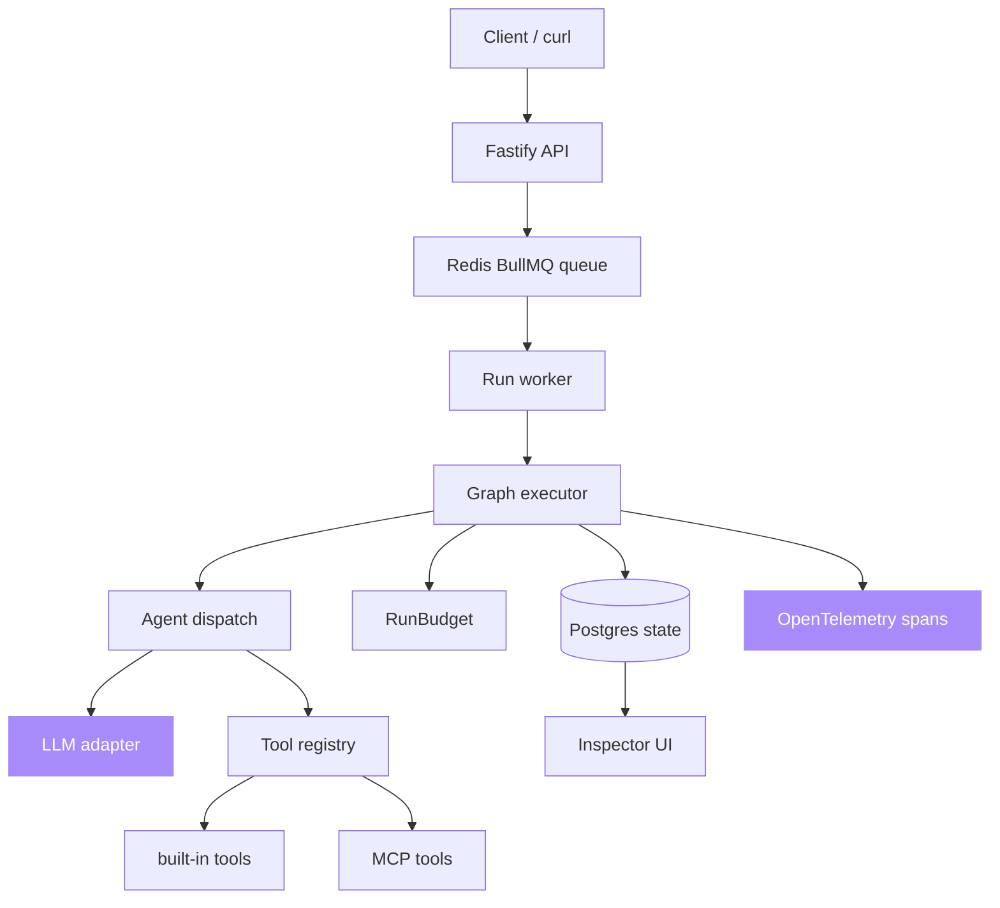
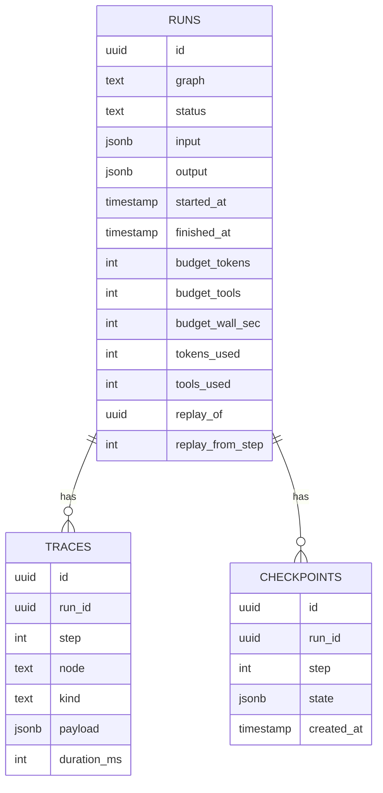

# Architecture

This is a small pnpm monorepo with two apps. `apps/api` is the Fastify control
plane and the graph executor. `apps/inspector` is a Next.js UI that reads run
state and draws the agent graph. State lives in Postgres through Drizzle ORM,
and runs are distributed through a Redis BullMQ queue.

## Run lifecycle

1. A client posts to `POST /runs` naming a registered graph and an input payload.
2. The API writes a `runs` row and enqueues the run. With `REDIS_URL` set the job
   goes to BullMQ; without it the run executes in-process.
3. The executor walks the graph from its entry nodes. For each node it writes an
   `enter` trace event, dispatches to the agent kind, then writes an `exit` event
   and a checkpoint.
4. Every LLM and tool call is charged against the run's `RunBudget`. A breach
   aborts the run through an `AbortSignal` and sets status `budget_exceeded`.
5. When the walk completes the run lands in `completed` with its output. Failures
   land in `failed` with the error recorded on the run and in the trace.

## Components

### Graph DSL (`src/graph/definition.ts`)

A graph is nodes plus edges plus a budget, built with a small fluent API. Nodes
carry an agent kind, an optional LLM key, optional tool names, and optional
concurrency. Edges may carry a `when` predicate for conditional routing. The
`toShape()` method serialises the topology for the inspector.

### Executor (`src/graph/executor.ts`)

Walks the graph in dependency order, enqueuing a node only once all of its
upstream nodes have run and at least one incoming edge predicate is satisfied. It
threads one `RunBudget` through every node, checkpoints the context after each
node, and wraps the run and each node in OpenTelemetry spans. On a replay run it
rehydrates context from the latest checkpoint at or before the requested step and
resumes from the cut.

### Agents (`src/graph/agents.ts`)

`pipeline` runs one LLM pass (when an LLM is set) then invokes each declared tool
in order. `supervisor` runs one LLM pass whose decision is exposed on the context
so conditional edges can branch on it. `swarm` runs `concurrency` parallel LLM
passes and merges the results.

### Budgets (`src/budgets`)

`RunBudget` bundles the token, tool-call, and wall-clock limits and owns the
`AbortController`. `TokenBudget` and `ToolBudget` are the underlying counters;
`ToolBudget` also enforces per-tool caps. A breach throws `BudgetExceededError`,
which the executor maps to the `budget_exceeded` status.

### Tools (`src/tools`)

The registry validates arguments against a Zod schema before the handler runs and
charges the call against the run budget first, so a breach aborts before any side
effect. MCP tools are registered through the same registry and share that budget.

### State (`src/state`)

`StateStore` is the contract. `PostgresStore` is the durable default; `MemoryStore`
backs tests and offline development. The store is selected from `DATABASE_URL` at
start-up.

### Queue (`src/queue`)

`enqueueRun` adds a job to BullMQ with the retry policy applied, or runs in-process
when Redis is absent. `startWorker` processes jobs and retries failures with
exponential backoff.

### Telemetry (`src/telemetry`)

`startTelemetry` boots the OpenTelemetry Node SDK and exports over OTLP/HTTP when
an endpoint is configured. `tracer()` returns the shared tracer used across the
executor and agents.

## Database schema

## Why these choices

Postgres plus Drizzle is the state store because it survives process crashes and
gives SQL access to inspect runs after the fact. Redis with BullMQ handles
queueing so workers can be restarted and scaled horizontally, and gives retry
policies for free. Trace events are written on every step because debugging an
agent failure hours later needs the full sequence of decisions. Budgets are hard
limits enforced through an `AbortSignal` because soft limits get ignored in
practice. OpenTelemetry is the tracing layer because it is the standard and lets
you ship spans to whatever backend you already run.
