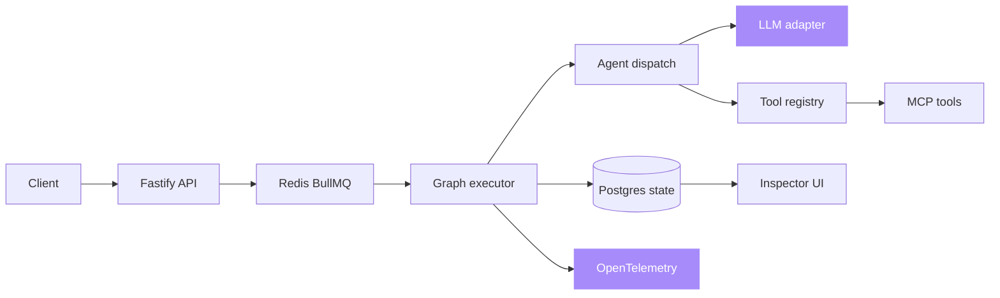

# agent-orchestrator

[](https://opensource.org/licenses/MIT)
[](https://github.com/sarmakska/agent-orchestrator)
[](https://github.com/sarmakska/agent-orchestrator/commits/main)
[](https://github.com/sarmakska/agent-orchestrator/actions/workflows/ci.yml)

**Multi-agent workflows that survive 2am: durable state, deterministic replay, hard budgets, and full tracing.**

Workflows are typed graphs, state is durable in Postgres, and every step writes a trace event you can replay deterministically. Agents have explicit token, tool-call, and wall-clock budgets that actually halt execution, and every run, node, LLM call, and tool call is wrapped in an OpenTelemetry span. A Next.js inspector draws the agent graph and lets you walk any run step by step.

Built by [Sarma Linux](https://sarmalinux.com). Full documentation lives in the [project wiki](https://github.com/sarmakska/agent-orchestrator/wiki).

---

## What this is

Most agent frameworks are demos with delusions of grandeur. They fall over the moment a tool times out or a model hallucinates a parameter. This orchestrator is built around the assumption that everything will fail, repeatedly, and that you need to debug what your agents did six hours after the fact.

The orchestrators that survive 2am have four properties, and this one has all four:

1. **Durable state.** A run is checkpointed after every node, so a crash resumes from the last checkpoint.
2. **Deterministic replay.** Reconstruct any run from a checkpointed step without re-executing earlier nodes.
3. **Hard budgets.** Token, tool-call, and wall-clock limits that abort the run rather than logging a warning.
4. **Visible execution.** Every step recorded and queryable, with OpenTelemetry spans for external tracing.

## Architecture



See [ARCHITECTURE.md](ARCHITECTURE.md) for the run lifecycle, the component breakdown, and the database schema.

## What is in the box

- **Graph DSL** (`apps/api/src/graph/definition.ts`). Typed nodes and edges, conditional transitions, and per-graph budgets in plain TypeScript. Every graph is structurally validated at registration, so a dangling edge, a cycle, an unreachable node, or a missing entry node is rejected with a precise error before a single run starts.
- **Durable executor** (`apps/api/src/graph/executor.ts`) backed by Postgres and Drizzle ORM. Every node is checkpointed, so a crashed run resumes from where it stopped.
- **Real agent dispatch** (`apps/api/src/graph/agents.ts`). Supervisor, swarm, and pipeline kinds that call the LLM adapter and the tool registry.
- **Budget enforcement** (`apps/api/src/budgets`). Token, tool-call, wall-clock, and per-tool limits that abort the run through an `AbortSignal`.
- **Deterministic replay**. Resume a run from a checkpointed step without re-running earlier nodes.
- **BullMQ run queue** (`apps/api/src/queue`) with a configurable retry policy. Degrades to in-process execution when Redis is absent.
- **OpenTelemetry tracing** (`apps/api/src/telemetry`). Spans for every run, node, LLM call, and tool call, exported over OTLP/HTTP.
- **Tool registry and MCP** (`apps/api/src/tools`). Register Zod-validated tools, or wrap a Model Context Protocol server. Both share one tool budget.
- **Fastify API** that drives runs and exposes run state and graph topology.
- **Inspector UI** (`apps/inspector`). A Next.js app with a run list, a run detail view, and an agent-graph visualisation.

## When to use this / when not to

Use this when you are running multi-step agent pipelines in production and you need them to survive process crashes, when you need an audit trail of exactly what each agent did, when you want hard budgets that stop a runaway loop, or when you need to reproduce a past run deterministically for debugging.

Do not reach for this if you are prototyping a single prompt or a one-shot chat completion. The durable state, queue, and Postgres dependency are overhead you do not need for a demo. It is also not a model provider or a hosted service. You bring your own LLM and run the stack yourself.

## Quick start

```bash
git clone https://github.com/sarmakska/agent-orchestrator.git
cd agent-orchestrator && pnpm install
docker compose up -d postgres redis
cp .env.example .env && pnpm migrate
pnpm dev
```

The inspector is at `http://localhost:3000`, the API at `http://localhost:4000`. Two example graphs (`research-swarm` and `triage`) are registered at start-up. Trigger one:

```bash
curl -X POST http://localhost:4000/runs \
  -H "Content-Type: application/json" \
  -d '{"graph":"triage","input":{"intent":"refund"}}'
```

Open the returned run id in the inspector to watch the graph light up step by step.

> No Postgres, Redis, or LLM key? Leave `DATABASE_URL`, `REDIS_URL`, and `SARMALINK_API_KEY` unset. The API falls back to an in-memory store, runs in-process, and the LLM adapter returns deterministic offline output. This is the same path the test suite uses.

## Defining a graph

Graphs are registered in `apps/api/src/graphs/index.ts`. The research swarm example (`apps/api/examples/research-swarm/graph.ts`) reads:

```ts
import { graph } from '../../src/graph/definition.js'

export const research = graph('research-swarm')
  .node('plan',      { agent: 'supervisor', llm: 'sarmalink' })
  .node('search',    { agent: 'pipeline',   tools: ['web_search'] })
  .node('analyse',   { agent: 'swarm',      llm: 'sarmalink', concurrency: 3 })
  .node('summarise', { agent: 'pipeline',   llm: 'sarmalink' })
  .edge('plan', 'search')
  .edge('search', 'analyse')
  .edge('analyse', 'summarise')
  .budget({ tokens: 50000, tools: 100, wallClockSec: 300, perTool: { web_search: 20 } })
```

Every graph is validated when you `register` it. The executor walks a graph assuming it is a finite DAG with at least one entry node, so I reject anything that breaks that assumption up front rather than letting it produce a silently wrong run:

```ts
import { GraphValidationError } from '../../src/graph/definition.js'

const broken = graph('broken')
  .node('a', { agent: 'pipeline' })
  .node('b', { agent: 'pipeline' })
  .edge('a', 'b')
  .edge('b', 'a') // cycle, and now neither node is an entry

try {
  register(broken)
} catch (e) {
  if (e instanceof GraphValidationError) console.error(e.problems)
  // [ 'graph has no entry node (every node has an incoming edge)',
  //   'cycle detected: a -> b -> a' ]
}
```

`graph.problems()` returns the same list without throwing, which is handy in a CI check or a custom loader. It reports dangling edges, duplicate edges, cycles (with the offending path), unreachable nodes, and missing entry nodes in a single pass.

## Authoring a tool

```ts
import { tool } from '../../src/tools/registry.js'
import { z } from 'zod'

export const stripeRefund = tool('stripe_refund', {
  description: 'Refund a Stripe charge by ID',
  schema: z.object({ chargeId: z.string(), amountPence: z.number().int() }),
  handler: async ({ chargeId, amountPence }) => ({ refundId: `re_${chargeId}`, amountPence }),
})
```

Reference it by name from any node's `tools` array. Tool calls are validated against the schema and charged against the run's tool budget before the handler runs. MCP tools register through `registerMcpTool` and share the same budget.

## Replay

```bash
curl -X POST http://localhost:4000/runs/<run-id>/replay \
  -H "Content-Type: application/json" \
  -d '{"fromStep": 2}'
```

This creates a new run that rehydrates context from the checkpoint at step 2 and resumes the walk, skipping the nodes that already ran.

## Documentation

- [Architecture](https://github.com/sarmakska/agent-orchestrator/wiki/Architecture)
- [Quick Start](https://github.com/sarmakska/agent-orchestrator/wiki/Quick-Start)
- [Graph DSL](https://github.com/sarmakska/agent-orchestrator/wiki/Graph-DSL)
- [Budgets and tracing](https://github.com/sarmakska/agent-orchestrator/wiki/Budgets-and-Tracing)
- [Roadmap](ROADMAP.md) and [Changelog](CHANGELOG.md)

## License

MIT. Built by [Sarma Linux](https://sarmalinux.com).

---

## More open source by Sarma

Part of a portfolio of twelve production-shaped open-source repositories built and maintained by [Sarma](https://sarmalinux.com).

| Repository | What it is |
|---|---|
| [Sarmalink-ai](https://github.com/sarmakska/Sarmalink-ai) | Multi-provider OpenAI-compatible AI gateway with 14-engine failover and intent-based plugin auto-routing |
| [agent-orchestrator](https://github.com/sarmakska/agent-orchestrator) | Durable multi-agent workflows in TypeScript with deterministic replay and Inspector UI |
| [voice-agent-starter](https://github.com/sarmakska/voice-agent-starter) | Sub-second full-duplex voice agent loop. WebRTC, mediasoup, pluggable STT / LLM / TTS |
| [ai-eval-runner](https://github.com/sarmakska/ai-eval-runner) | Evals as code. Python, DuckDB, FastAPI viewer, regression mode for CI |
| [mcp-server-toolkit](https://github.com/sarmakska/mcp-server-toolkit) | Production Model Context Protocol server starter (Python / FastAPI) |
| [local-llm-router](https://github.com/sarmakska/local-llm-router) | OpenAI-compatible proxy that routes to Ollama or cloud providers based on policy |
| [rag-over-pdf](https://github.com/sarmakska/rag-over-pdf) | Minimal end-to-end RAG starter for PDF corpora |
| [receipt-scanner](https://github.com/sarmakska/receipt-scanner) | Vision OCR for receipts with Zod-validated JSON output |
| [webhook-to-email](https://github.com/sarmakska/webhook-to-email) | Webhook receiver that forwards events to email via Resend |
| [k8s-ops-toolkit](https://github.com/sarmakska/k8s-ops-toolkit) | Helm chart for shipping Next.js to Kubernetes with full observability stack |
| [terraform-stack](https://github.com/sarmakska/terraform-stack) | Vercel + Supabase + Cloudflare + DigitalOcean modules in one Terraform repo |
| [staff-portal](https://github.com/sarmakska/staff-portal) | Open-source HR / ops portal for leave, attendance, expenses, kiosk mode |

Engineering essays at [sarmalinux.com/blog](https://sarmalinux.com/blog) &middot; All projects at [sarmalinux.com/open-source](https://sarmalinux.com/open-source)

## Star History

<a href="https://www.star-history.com/#sarmakska/agent-orchestrator&Date">
 <picture>
   <source media="(prefers-color-scheme: dark)" srcset="https://api.star-history.com/svg?repos=sarmakska/agent-orchestrator&type=Date&theme=dark" />
   <source media="(prefers-color-scheme: light)" srcset="https://api.star-history.com/svg?repos=sarmakska/agent-orchestrator&type=Date" />
   
 </picture>
</a>
