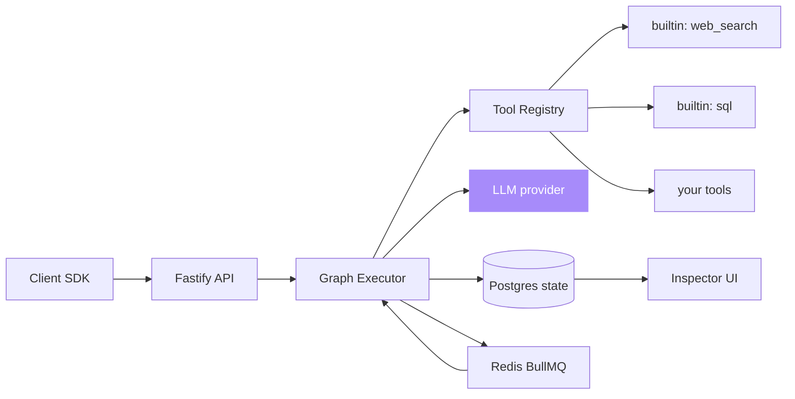

# agent-orchestrator

[](https://opensource.org/licenses/MIT)
[](https://nodejs.org)
[](https://typescriptlang.org)
[](https://postgresql.org)
[](https://orm.drizzle.team)
[](https://github.com/sarmakska/agent-orchestrator)

## Star History

<a href="https://www.star-history.com/#sarmakska/agent-orchestrator&Date">
 <picture>
   <source media="(prefers-color-scheme: dark)" srcset="https://api.star-history.com/svg?repos=sarmakska/agent-orchestrator&type=Date&theme=dark" />
   <source media="(prefers-color-scheme: light)" srcset="https://api.star-history.com/svg?repos=sarmakska/agent-orchestrator&type=Date" />
   
 </picture>
</a>

**Multi-agent workflows with deterministic replay, durable state, and tool budgets.**

Built by [Sarma Linux](https://sarmalinux.com).

---

## What this is

Most agent frameworks are demos with delusions of grandeur. They fall over the moment a tool times out or a model hallucinates a parameter. This orchestrator is built around the assumption that everything will fail, repeatedly, and that you need to debug what your agents did six hours after the fact.

Workflows are typed graphs. State is durable in Postgres. Every step writes a trace event that can be replayed deterministically. Agents have explicit tool, token, and wall-clock budgets, all enforced. Supports supervisor, swarm, and pipeline patterns. Ships with a web inspector to walk runs step by step.

## Architecture



## Why another orchestrator

Honest answer: every existing framework I tried in production left me debugging strange failures at 2am. The orchestrators that survive 2am have these properties:

1. **Durable state.** Process crashes, resumes from the last checkpoint.
2. **Deterministic replay.** Given the trace, I can reproduce the run exactly.
3. **Hard budgets.** Token, tool-call, and wall-clock limits that actually halt execution.
4. **Visible execution.** Every step recorded, queryable, replayable from any point.

This orchestrator has all four. Most don't.

## Quick start

```bash
git clone https://github.com/sarmakska/agent-orchestrator.git
cd agent-orchestrator
pnpm install
docker compose up -d postgres redis
cp .env.example .env
pnpm migrate
pnpm dev
```

Inspector at `http://localhost:3000`. API at `http://localhost:4000`.

## Defining a graph

```ts
import { graph } from '@sarmalinux/agent-orchestrator'

export const research = graph('research-swarm')
  .node('plan',     { agent: 'supervisor', llm: 'sarmalink' })
  .node('search',   { agent: 'pipeline',   tools: ['web_search'] })
  .node('analyse',  { agent: 'swarm',      llm: 'sarmalink', concurrency: 3 })
  .node('summarise',{ agent: 'pipeline',   llm: 'sarmalink' })
  .edge('plan', 'search')
  .edge('search', 'analyse')
  .edge('analyse', 'summarise')
  .budget({ tokens: 50000, tools: 100, wallClockSec: 300 })
```

Run:

```ts
const run = await research.run({ topic: 'mediasoup vs LiveKit in 2026' })
console.log(run.id)  // inspect at http://localhost:3000/runs/<run.id>
```

## Tool authoring

```ts
import { tool } from '@sarmalinux/agent-orchestrator'
import { z } from 'zod'

export const stripeRefund = tool('stripe_refund', {
  description: 'Refund a Stripe charge by ID',
  schema: z.object({ chargeId: z.string(), amountPence: z.number().int() }),
  handler: async ({ chargeId, amountPence }) => {
    // call Stripe...
    return { refundId: 're_...' }
  },
})
```

Drop into the registry, reference by name from any node.

## Roadmap

- [x] Graph DSL with typed nodes and edges
- [x] Postgres-backed durable state
- [x] Deterministic replay
- [x] Token / tool / wall-clock budgets
- [x] Supervisor, swarm, pipeline patterns
- [x] Inspector UI with live graph view
- [ ] Per-tool rate limits
- [ ] Cost dashboards
- [ ] OpenTelemetry trace export
- [ ] kubectl-style CLI

## License

MIT.

Built by [Sarma Linux](https://sarmalinux.com).

---

## More open source by Sarma

Part of a portfolio of twelve production-shaped open-source repositories built and maintained by [Sarma](https://sarmalinux.com).

| Repository | What it is |
|---|---|
| [Sarmalink-ai](https://github.com/sarmakska/Sarmalink-ai) | Multi-provider OpenAI-compatible AI gateway with 14-engine failover and intent-based plugin auto-routing |
| [agent-orchestrator](https://github.com/sarmakska/agent-orchestrator) | Durable multi-agent workflows in TypeScript with deterministic replay and Inspector UI |
| [voice-agent-starter](https://github.com/sarmakska/voice-agent-starter) | Sub-second full-duplex voice agent loop. WebRTC, mediasoup, pluggable STT / LLM / TTS |
| [ai-eval-runner](https://github.com/sarmakska/ai-eval-runner) | Evals as code. Python, DuckDB, FastAPI viewer, regression mode for CI |
| [mcp-server-toolkit](https://github.com/sarmakska/mcp-server-toolkit) | Production Model Context Protocol server starter (Python / FastAPI) |
| [local-llm-router](https://github.com/sarmakska/local-llm-router) | OpenAI-compatible proxy that routes to Ollama or cloud providers based on policy |
| [rag-over-pdf](https://github.com/sarmakska/rag-over-pdf) | Minimal end-to-end RAG starter for PDF corpora |
| [receipt-scanner](https://github.com/sarmakska/receipt-scanner) | Vision OCR for receipts with Zod-validated JSON output |
| [webhook-to-email](https://github.com/sarmakska/webhook-to-email) | Webhook receiver that forwards events to email via Resend |
| [k8s-ops-toolkit](https://github.com/sarmakska/k8s-ops-toolkit) | Helm chart for shipping Next.js to Kubernetes with full observability stack |
| [terraform-stack](https://github.com/sarmakska/terraform-stack) | Vercel + Supabase + Cloudflare + DigitalOcean modules in one Terraform repo |
| [staff-portal](https://github.com/sarmakska/staff-portal) | Open-source HR / ops portal — leave, attendance, expenses, kiosk mode |

Engineering essays at [sarmalinux.com/blog](https://sarmalinux.com/blog) &middot; All projects at [sarmalinux.com/open-source](https://sarmalinux.com/open-source)
